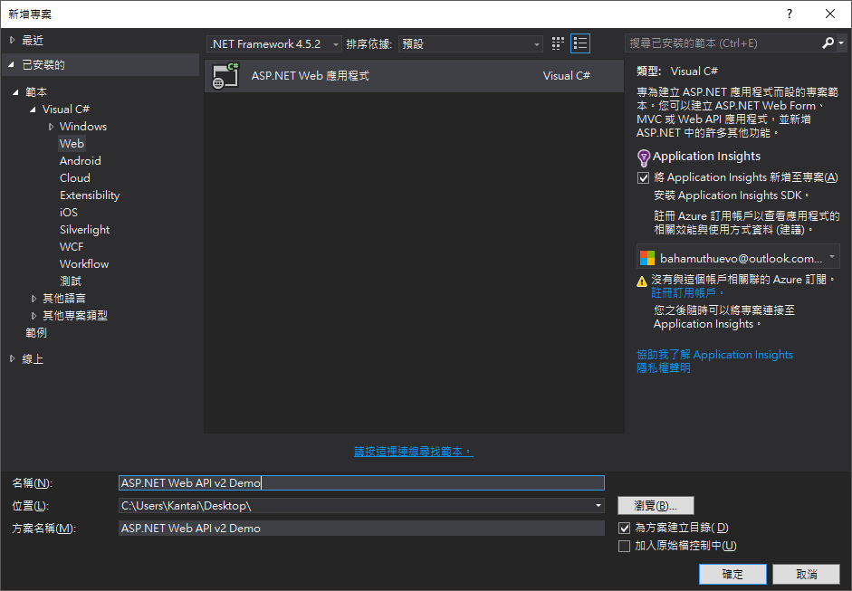
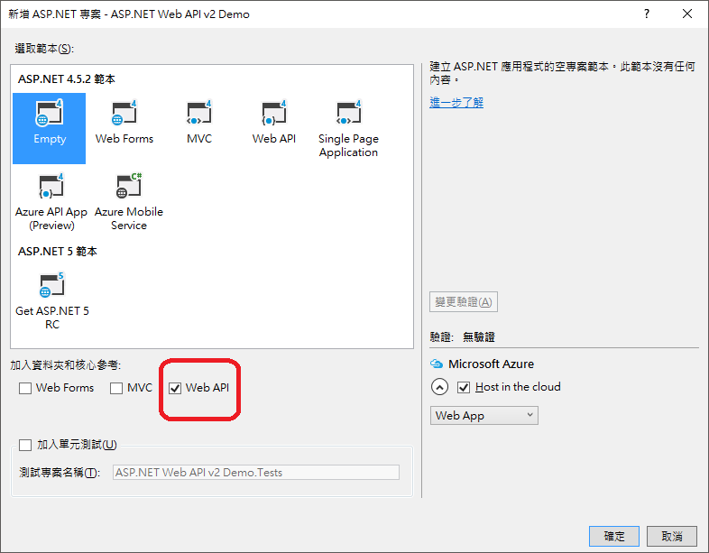
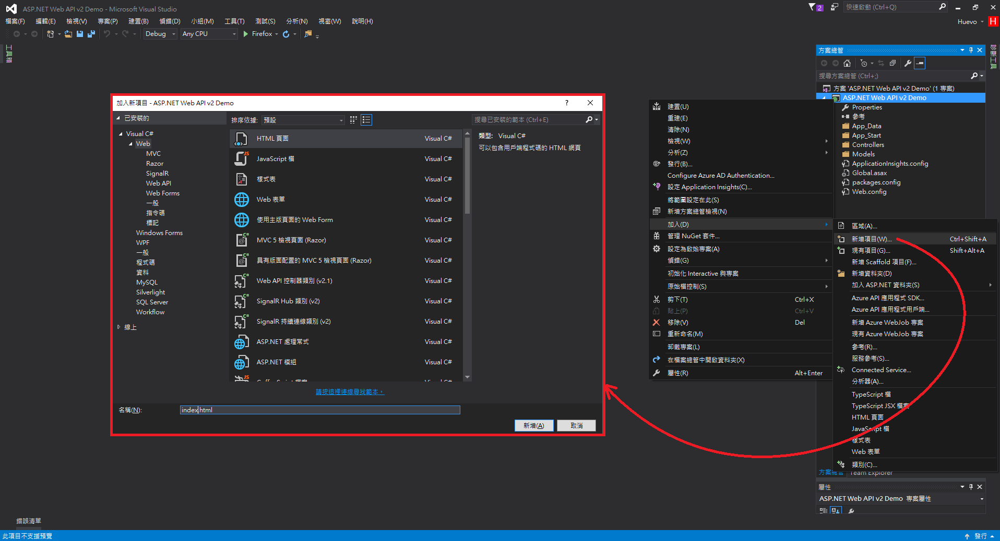
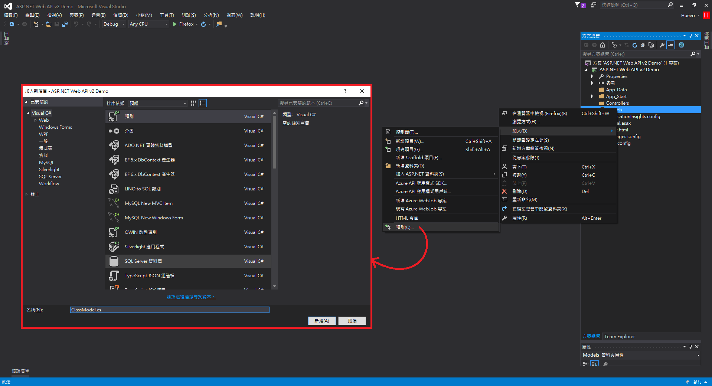
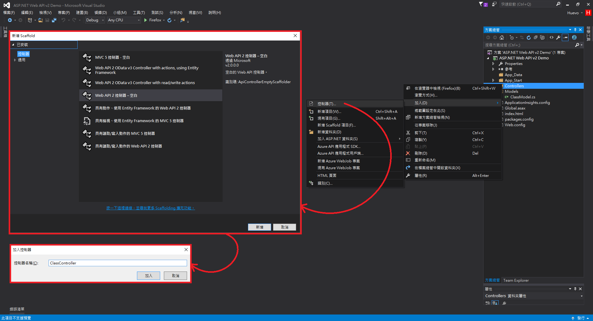
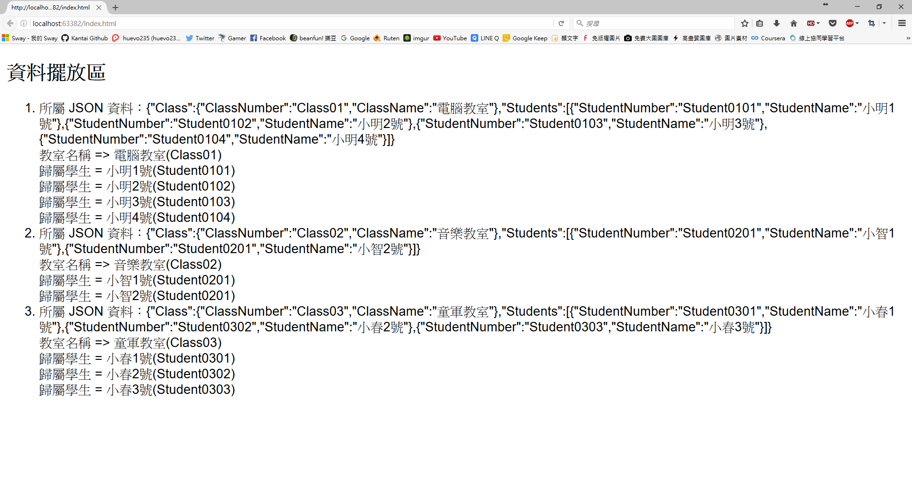
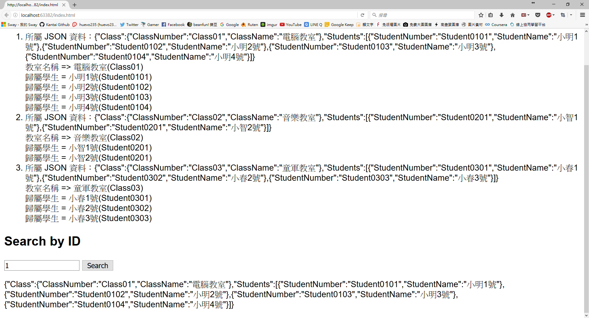

在開發網頁應用程式，有時候會遇到一種情境，我們為了這個網頁做了很大量的開發，累積了很多使用者，但當我們想開發一些 API 應用給第三方開發者使用時，我們該怎麼辦呢？

[ASP.NET](https://www.asp.net/) 提供了一個很好的架構，就是 [ASP.NET Web API 2](https://msdn.microsoft.com/zh-tw/library/dn448365(v=vs.118).aspx)，他可以輕鬆地幫你建置出 HTTP 服務下 API 應用，而本教學文章將帶大家了解這東西的基礎教學！

(1.) 首先我們要先在 [Visual Studio](https://www.visualstudio.com/zh-hant/) 當中建立一個 Web Application 專案：



(2.) 為了方便介紹，我們用空白專案(Empty)即可，不過這個地方需要注意一下！你必須勾選 `Web API` 這項核心參考：



(3.) 創建完專案後，Run 一下會發現整個網站空空如也，給你各種 404 找不到網頁，所以我們必須先來建立一個 `index.html` 的入口網頁：



(4.) 再來我們希望 Web API 回傳的資料直接 show 在網頁上，所以我們要先定義一個地方，準備用來 show 資料：

```html
<!DOCTYPE html>
<html>
<head>
<meta http-equiv="Content-Type" content="text/html; charset=utf-8"/>
    <title></title>
	<meta charset="utf-8" />
</head>
<body>
    <div>
        <h2>資料擺放區</h2>
        <ul id="showData"></ul>
    </div>
</body>
</html>
```

(5.) 定義完之後，我們要開始思考，我們想拿到甚麼資料？資料的格式長甚麼樣子？我們就用之前寫過的 [Java 或 Android 上的 Json 基本教學](https://blog.init.engineer/posts/BasicUsingJsonOnJavaOrAndroid/) 當中的格式作為範例，我們必須先在 Models 新增我們的 Model：



(6.) 接下來我們要定義 model 的格式：

```cs
using System;
using System.Collections.Generic;
using System.Linq;
using System.Web;

namespace ASP.NET_Web_API_v2_Demo.Models
{
    public class ClassModel
    {

        public ClassDetail Class { get; set;}

        public class ClassDetail
        {
            public ClassDetail(String number, String name) {
                this.ClassNumber = number;
                this.ClassName = name;
            }

            public String ClassNumber { get; set; }
            public String ClassName { get; set; }
        }
        
        public StudentDetail[] Students { get; set; }
        
        public class StudentDetail
        {
            public StudentDetail(String number, String name) {
                this.StudentNumber = number;
                this.StudentName = name;
            }

            public String StudentNumber { get; set; }
            public String StudentName { get; set; }
        }

    }
}
```

(7.) 資料的格式定義完之後，我們接下來要再建立一個控制器(Controller)做來建立資料、拋出資料的動作，這一切都是遵循 [MVC模式(Model–View–Controller)](https://zh.wikipedia.org/wiki/MVC) 的開發模式：



(8.) 接下來撰寫控制器，去定義資料、拋出資料的方式、找尋資料的方式，不過我們這邊先把資料寫死 [Hard Code](https://zh.wikipedia.org/zh-tw/%E5%AF%AB%E6%AD%BB)：

```cs
using ASP.NET_Web_API_v2_Demo.Models;
using System;
using System.Collections.Generic;
using System.Linq;
using System.Net;
using System.Net.Http;
using System.Web.Http;

namespace ASP.NET_Web_API_v2_Demo.Controllers
{
    public class ClassController : ApiController
    {
        ClassModel[] classModel = new ClassModel[] {
            new ClassModel {
                Class = new ClassModel.ClassDetail("Class01", "電腦教室"),
                Students = new ClassModel.StudentDetail[] {
                    new ClassModel.StudentDetail("Student0101", "小明1號"),
                    new ClassModel.StudentDetail("Student0102", "小明2號"),
                    new ClassModel.StudentDetail("Student0103", "小明3號"),
                    new ClassModel.StudentDetail("Student0104", "小明4號")
                }
            },
            new ClassModel {
                Class = new ClassModel.ClassDetail("Class02", "音樂教室"),
                Students = new ClassModel.StudentDetail[] {
                    new ClassModel.StudentDetail("Student0201", "小智1號"),
                    new ClassModel.StudentDetail("Student0201", "小智2號")
                }
            },
            new ClassModel {
                Class = new ClassModel.ClassDetail("Class03", "童軍教室"),
                Students = new ClassModel.StudentDetail[] {
                    new ClassModel.StudentDetail("Student0301", "小春1號"),
                    new ClassModel.StudentDetail("Student0302", "小春2號"),
                    new ClassModel.StudentDetail("Student0303", "小春3號")
                }
            }
        };

        public IEnumerable<ClassModel> GetAllClass()
        {
            return classModel;
        }

        public IHttpActionResult GetClass(String __classNumber)
        {
            var detail = classModel.FirstOrDefault((c) => c.Class.ClassNumber == __classNumber);
            if (detail == null)
                return NotFound();
            else
                return Ok(detail);
        }
    }
}
```

(9.) 資料格式的模型(Model)寫完了，控制器(Controller)也寫完了，接下來我們回到 `index.html` 去撰寫網頁端的程式吧！我們透過 ajax 來抓資料：

```html
<!DOCTYPE html>
<html xmlns="http://www.w3.org/1999/xhtml">
<head>
    <meta http-equiv="Content-Type" content="text/html; charset=utf-8" />
    <title></title>
    <meta charset="utf-8" />
</head>
<body>
    <div>
        <h2>資料擺放區</h2>
        <ol id="data"></ol>
    </div>

    <script src="http://ajax.aspnetcdn.com/ajax/jQuery/jquery-2.0.3.min.js"></script>
    <script>
        var uri = 'api/class';
        $(document).ready(function () {
            $.getJSON(uri).done(
                function (data) {
                    $.each(data, function (key, item) {
                        $('<li>', { html : formatItem(item) }).appendTo($('#data'));
                    });
                }
            );
        });

        function formatItem(item) {
            var __response = '所屬 JSON 資料：' + JSON.stringify(item) + '<br />';
            __response += '教室名稱 => ' + item.Class.ClassName + '(' + item.Class.ClassNumber + ')<br />';
            $.each(item.Students, function (key, item) {
                __response += '歸屬學生 = ' + item.StudentName + '(' + item.StudentNumber + ')<br />';
            });
            return __response;
        }
    </script>
</body>
</html>
```

(10.) 完成後，我們來看看成果吧！



(11.) 不過目前只是抓出所有資料，對應的是在控制器當中的 GetAllClass 這個方法，我們希望善用到 GetProduct 這方法，去搜尋個別的教室，所以我們要在 `index.html` 當中多添加個輸入框及按鈕，並且透過 GetProduct 去撈取相對應的資料：

```html
<!DOCTYPE html>
<html xmlns="http://www.w3.org/1999/xhtml">
<head>
    <meta http-equiv="Content-Type" content="text/html; charset=utf-8" />
    <title></title>
    <meta charset="utf-8" />
</head>
<body>
    <div>
        <h2>資料擺放區</h2>
        <ol id="data"></ol>
    </div>
    <div>
        <h2>Search by ID</h2>
        <input type="text" id="class" size="20" />
        <input type="button" value="Search" onclick="find();" />
        <p id="detail"></p>
    </div>
    <script src="http://ajax.aspnetcdn.com/ajax/jQuery/jquery-2.0.3.min.js"></script>
    <script>
        var uri = 'api/class';

        $(document).ready(function () {
            $.getJSON(uri).done(
                function (data) {
                    $.each(data, function (key, item) {
                        $('<li>', { html : formatItem(item) }).appendTo($('#data'));
                    });
                }
            );
        });

        function formatItem(item) {
            var __response = '所屬 JSON 資料：' + JSON.stringify(item) + '<br />';
            __response += '教室名稱 => ' + item.Class.ClassName + '(' + item.Class.ClassNumber + ')<br />';
            $.each(item.Students, function (key, item) {
                __response += '歸屬學生 = ' + item.StudentName + '(' + item.StudentNumber + ')<br />';
            });
            return __response;
        }

        function find() {
            var id = $('#class').val();
            $.getJSON(uri + '/' + id)
                .done(function (data) {
                    $('#detail').text(JSON.stringify(data));
                })
                .fail(function (jqXHR, textStatus, err) {
                    $('#detail').text('Error: ' + err);
                });
        }
    </script>
</body>
</html>
```

(12.) 完成後我們來看看成果吧！



整個 ASP.NET Web API v2 的基本教學大致上是這樣 m(_ _)m

其他官方教學與範例：[Learn About ASP.NET Web API](https://www.asp.net/web-api)
