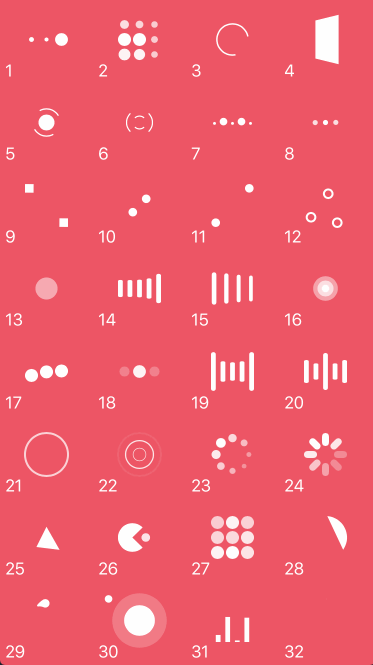
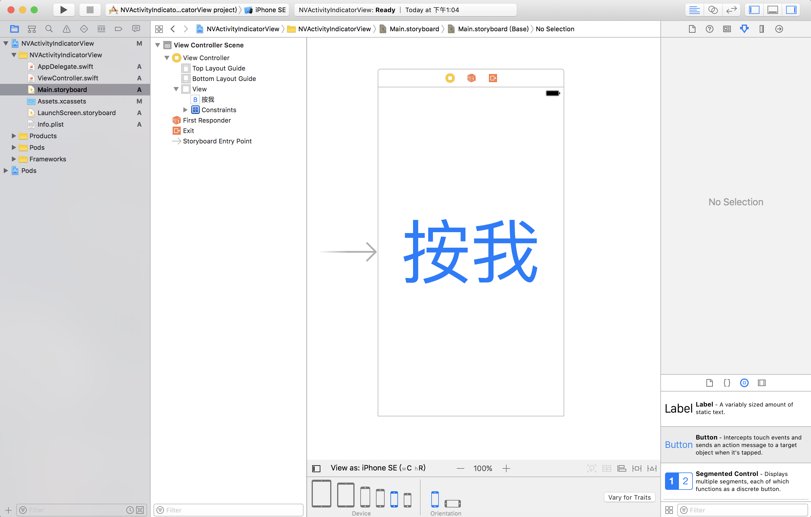

## 簡介

[NVActivityIndicatorView](https://github.com/ninjaprox/NVActivityIndicatorView) 是一系列令人驚艷的 Loading 動畫，它採用了向量繪圖的方式來呈現動畫，這是 [DGActivityIndicatorView](https://github.com/gontovnik/DGActivityIndicatorView) 的一個衍生，靈感來自於 [Loaders.css](https://github.com/ConnorAtherton/loaders.css)。

+ [NVActivityIndicatorView GitHub 官方網站](https://github.com/ninjaprox/NVActivityIndicatorView)

## 範例



| Type                   | Type                        | Type                   | Type                       |
|------------------------|-----------------------------|------------------------|----------------------------|
| 1. ballPulse           | 2. ballGridPulse            | 3. ballClipRotate      | 4. squareSpin              |
| 5. ballClipRotatePulse | 6. ballClipRotateMultiple   | 7. ballPulseRise       | 8. ballRotate              |
| 9. cubeTransition      | 10. ballZigZag              | 11. ballZigZagDeflect  | 12. ballTrianglePath       |
| 13. ballScale          | 14. lineScale               | 15. lineScaleParty     | 16. ballScaleMultiple      |
| 17. ballPulseSync      | 18. ballBeat                | 19. lineScalePulseOut  | 20. lineScalePulseOutRapid |
| 21. ballScaleRipple    | 22. ballScaleRippleMultiple | 23. ballSpinFadeLoader | 24. lineSpinFadeLoader     |
| 25. triangleSkewSpin   | 26. pacman                  | 27. ballGridBeat       | 28. semiCircleSpin         |
| 29. ballRotateChase    | 30. orbit                   | 31. audioEqualizer     |                            | 

## 安裝

你必須採用 Cocoapods 來進行安裝，你可以參考 [CocoaPods iOS 第三方套件管理工具](https://blog.init.engineer/posts/CocoaPodsBasic/) 這篇文章。

然後將 `NVActivityIndicatorView` 加入你的 `Podfile` 當中。

```pod
use_frameworks!

pod 'NVActivityIndicatorView'
```

## 使用教學

首先，你必須先引入 `NVActivityIndicatorView` 至您的專案當中。

```swift
import NVActivityIndicatorView
```

接下來，有兩種方法可以建立 NVActivityIndicatorView

1. 透過 storyboard 來將 UIView 變更為 NVActivityIndicatorView
2. 利用寫程式的方式來建立。

```swift
NVActivityIndicatorView(frame: frame, type: type, color: color, padding: padding)
```

## 如何控制它呢？

### 啟動動畫

```swift
activityIndicatorView.startAnimating()
```

### 暫停動畫

```swift
activityIndicatorView.stopAnimating()
```

### 確認動畫是否正在運轉中

```swift
animating = activityIndicatorView.animating
```

## 我該如何用很懶的方式來使用它呢？

那麼你可以讓你的 `ViewController` 先參考 `NVActivityIndicatorViewable`，就像：

```swift
class ViewController: UIViewController, NVActivityIndicatorViewable {
    // Code ...
}
```

然後你就可以在你的程式碼當中，隨意新建 Loading 畫面、關閉畫面了，就像：

### 開啟動畫

```swift
startAnimating(size, message)
```

### 關閉動畫

```swift
stopAnimation()
```

### 讓我們來看看官方的 `startAnimating` 原始碼怎麼寫的吧！

```swift
public final func startAnimating(
    // 設定 Loading CG 的 Size
    _ size: CGSize? = nil,
    // 設定 Loading 顯示的訊息內容
    message: String? = nil,
    // 設定訊息內容的字型
    messageFont: UIFont? = nil,
    // 設定 CG 的樣式
    type: NVActivityIndicatorType? = nil,
    // 設定 CG 的顏色
    color: UIColor? = nil,
    // 設定 Padding
    padding: CGFloat? = nil,
    // 設定延遲時間
    displayTimeThreshold: Int? = nil,
    // 最小的延遲時間
    minimumDisplayTime: Int? = nil,
    // 背景顏色
    backgroundColor: UIColor? = nil,
    // 訊息內容顏色
    textColor: UIColor? = nil) {

    let activityData = ActivityData(size: size,
                                    message: message,
                                    messageFont: messageFont,
                                    type: type,
                                    color: color,
                                    padding: padding,
                                    displayTimeThreshold: displayTimeThreshold,
                                    minimumDisplayTime: minimumDisplayTime,
                                    backgroundColor: backgroundColor,
                                    textColor: textColor)
    NVActivityIndicatorPresenter.sharedInstance.startAnimating(activityData)
}
```

### 再來讓我們來看看官方的 `stopAnimation` 原始碼怎麼寫的吧！

```swift
public final func stopAnimating() {
    // 就只是叫他停止而已 ...
    NVActivityIndicatorPresenter.sharedInstance.stopAnimating()
}
```

## 關於預設 ... 它都設定了些什麼？

### 預設的動畫

```swift
// 第 23 號的經典動畫
NVActivityIndicatorView.DEFAULT_TYPE = .ballSpinFadeLoader
```

### 預設的顏色

```swift
// 白色 RGB(255,255,255)
NVActivityIndicatorView.DEFAULT_COLOR = UIColor.white
```

### 預設的訊息內容顏色

```swift
// 白色 RGB(255,255,255)
NVActivityIndicatorView.DEFAULT_TEXT_COLOR = UIColor.white
```

### 預設的間距

```swift
// 沒有間距
NVActivityIndicatorView.DEFAULT_PADDING = CGFloat(0)
```

### 預設的 CG 大小

```swift
// 60 * 60
NVActivityIndicatorView.DEFAULT_BLOCKER_SIZE = CGSizeMake(60, 60)
```

### 預設的背景顏色

```swift
// 黑色 RGB(0,0,0) 透明度 50%
NVActivityIndicatorView.DEFAULT_BLOCKER_BACKGROUND_COLOR = UIColor(red: 0, green: 0, blue: 0, alpha: 0.5)
```

### 預設的延遲時間

```swift
// 沒有延遲
NVActivityIndicatorView.DEFAULT_BLOCKER_DISPLAY_TIME_THRESHOLD = 0 // 以毫秒計算
```

### 預設的最小延遲時間

```swift
// 沒有延遲
NVActivityIndicatorView.DEFAULT_BLOCKER_MINIMUM_DISPLAY_TIME = 0 // 以毫秒計算
```

### 預設的訊息內容

```swift
// 還是沒有任何內容
NVActivityIndicatorView.DEFAULT_BLOCKER_MESSAGE: String? = nil
```

### 預設的訊息內容字型

```swift
// 粗體、系統字型、大小 20
NVActivityIndicatorView.DEFAULT_BLOCKER_MESSAGE_FONT = UIFont.boldSystemFont(ofSize: 20)
```

## 實際範例

我們就來實際操作看看 NVActivityIndicatorView 的效果吧！首先我的 Podfile 配置如下：

```pod
# Uncomment the next line to define a global platform for your project
# platform :ios, '9.0'

target 'NVActivityIndicatorView' do
# Comment the next line if you're not using Swift and don't want to use dynamic frameworks
use_frameworks!

# Pods for NVActivityIndicatorView
pod 'NVActivityIndicatorView'

end
```

就只有參考一個 `NVActivityIndicatorView` 而已，接下來我們直接 `pod install` 去執行它。

執行完了以後，我們稍微設計一下畫面，在畫面中我們只需要一個 Button：



再來，我們希望說，按下這顆按鈕後，我們就顯示 Loading 的圖示，長達三秒，這時候我們就可以參考官方的範例：

```swift
@IBAction func didButtonOnClick(_ sender: Any) {
    let size = CGSize(width: 30, height: 30)
    
    startAnimating(size, message: "Loading...", type: NVActivityIndicatorType(rawValue: sender.tag)!)
    
    DispatchQueue.main.asyncAfter(deadline: DispatchTime.now() + 1.5) {
        NVActivityIndicatorPresenter.sharedInstance.setMessage("Authenticating...")
    }
    
    DispatchQueue.main.asyncAfter(deadline: DispatchTime.now() + 3) {
        self.stopAnimating()
    }
}
```

## 其他

當然你也可以試用看看官方的範例，會使你更快熟悉 `NVActivityIndicatorView` 這好用的第三方套件哦！

+ [NVActivityIndicatorView 官方 Demo - GtiHub](https://github.com/ninjaprox/NVActivityIndicatorView/blob/master/NVActivityIndicatorViewDemo/ViewController.swift)
