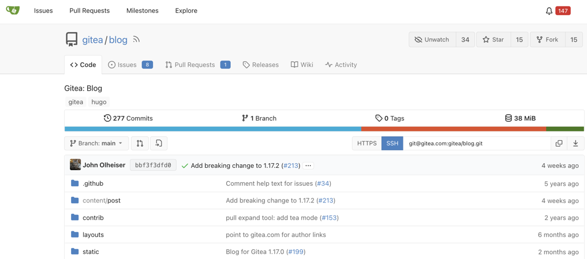

如果有在撰寫程式語言的人，或許就會知道 [GitHub](https://github.com) 這很好用的版本控制平台，另一方面很多企業徵求資訊人員的時候，通常也會要求應徵者提供自己的 [GitHub](https://github.com) 來讓公司知道該應徵者的 Code 能力位於哪個階段，或者該名人才有開發過哪些專案。

不過有時候礙於專案各種條款，不方便公開，但使用 [GitHub](https://github.com) 的話，又會限制 Private 的專案必須收費，所以今天要來推薦一套開源的產品，叫做「[Gitea](http://gitea.io)」，這東西它可以將類似於 [GitHub](https://github.com) 的網站架設於自己的伺服器當中，那我們接下來就直接開始吧！

[Gitea](https://gitea.io/zh-TW/) => https://gitea.io/zh-TW/



以下教學的作業系統為 macOS High Sierra 10.13

首先我們必須要安裝 [Homebrew](https://brew.sh/index_zh-tw.html) 這套件管理工具。

> Homebrew是一款自由及開放原始碼的軟體套件管理系統，用以簡化Mac OS X系統上的軟體安裝過程，最初由馬克斯·霍威爾（Max Howell）寫成。該包管理器在Ruby on Rails社群廣為人知，因其可延伸性得到了一致好評。
> 內容參考 https://zh.wikipedia.org/wiki/Homebrew


請開啟你的終端機，並輸入以下指令來安裝 Homebrew

```shell
/usr/bin/ruby -e "$(curl -fsSL https://raw.githubusercontent.com/Homebrew/install/master/install)"
```

安裝完畢了以後，我們需要透過 Homebrew 來安裝 Gitea：

```shell
brew tap go-gitea/gitea
brew install gitea
```

接下來我們就可以直接來架設 Gitea 伺服器了，以下是他的功能簡介(Help)：

```
NAME:
   Gitea - A painless self-hosted Git service

USAGE:
   gitea [global options] command [command options] [arguments...]

VERSION:
   1.0.2

COMMANDS:
     web      Start Gitea web server
     serv     This command should only be called by SSH shell
     update   This command should only be called by Git hook
     dump     Dump Gitea files and database
     cert     Generate self-signed certificate
     admin    Preform admin operations on command line
     help, h  Shows a list of commands or help for one command

GLOBAL OPTIONS:
   --help, -h     show help
   --version, -v  print the version
```

那我們可以先來試試看架設 Gitea web server，只要在終端機當中輸入：

```shell
gitea web
```

就可以開啟 Gitea Server 囉！不過要記得開啟你的資料庫，因為他會需要將使用者／其他設定存進資料庫當中。

其他 Gitea 使用上的教學，可以參考這篇文章：

[建置自己的 Git 伺服器與網站：Gitea（Gogs）](https://yami.io/gitea/)
