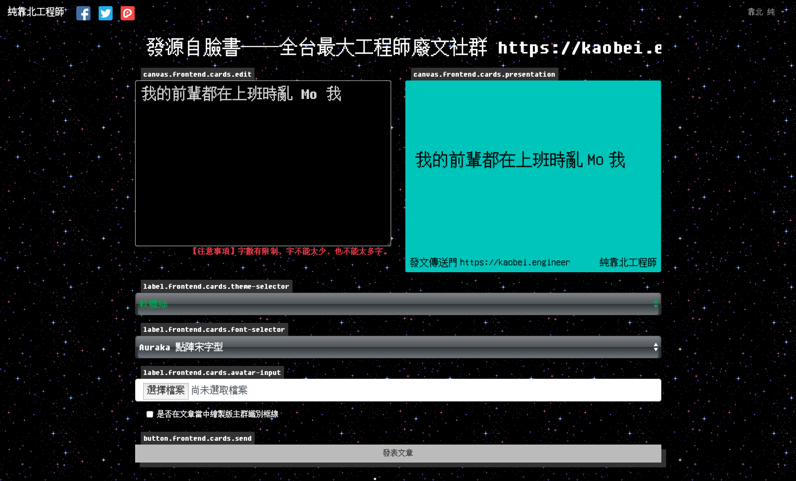
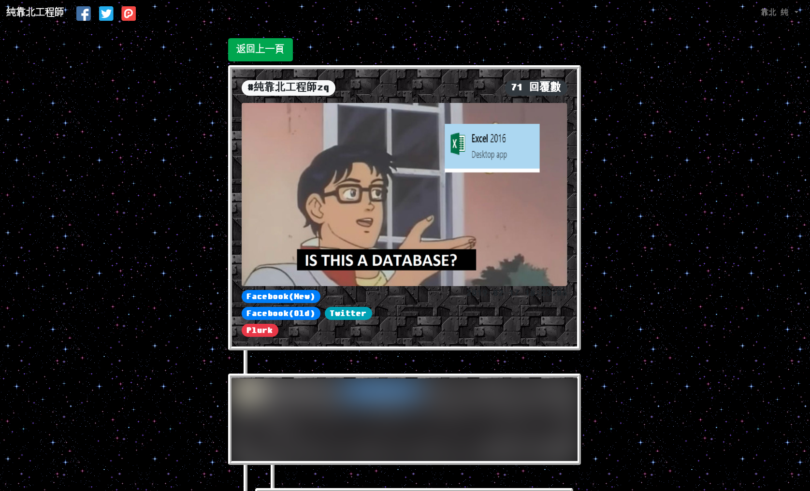
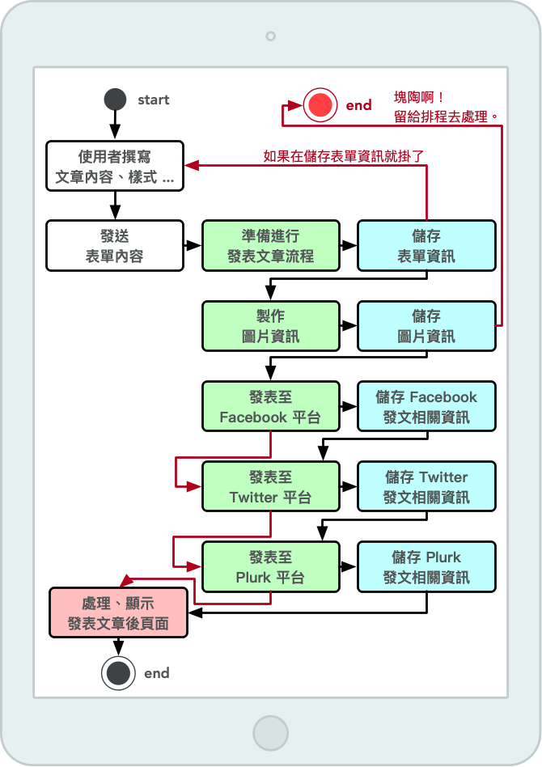

既然是社群匿名發文平台，那主要核心當然是發廢文、講幹話啦！可是這要怎麼做呢？文章管理三步驟：繪圖、發表文章、刪除文章。

- `P3. 純靠北工程師怎麼做的？一顆按鈕就把你的文章發到世界各地了呢！(1/2)(本篇)`
- P4. 純靠北工程師怎麼做的？一顆按鈕就把你的文章發到世界各地了呢！(2/2)
- P5. 純靠北工程師怎麼做的？一顆按鈕就把你的文章 BANG 不見！
- P6. 純靠北工程師怎麼做的？自幹前端一個繪圖、後端一個繪圖！前端篇
- P7. 純靠北工程師怎麼做的？自幹前端一個繪圖、後端一個繪圖！後端篇

---

## 簡介

這篇文章的主軸會環繞於 Facebook、Twitter、Plurk 這三個平台的 API 串接，

- 流程圖(Flowchart)
- Facebook API - fileToUpload/post/photo 串接

---

## 我應該怎麼開始？

首先我們需要先思考這整個流程，使用者情境大概是首先我們會有一個頁面(如圖一)提供使用者寫文章、選擇主題、選擇字型或上傳圖片，使用者做完這些事情後，按下按鈕直接送出，後端開始會處理圖片、將文章發佈至各平台當中，最後將顯示畫面結果(如圖二)，更詳細一點的話就是畫成`流程圖(Flowchart)`。

> [!] 流程圖(Flowchart) 科普一下 -> [流程圖 - 維基百科，自由的百科全書](https://zh.wikipedia.org/zh-tw/%E6%B5%81%E7%A8%8B%E5%9B%BE)


圖一、發表文章範例介面


圖二、顯示畫面結果

---

## 發表文章的流程大概是 ... ?

我們大致上設計成這樣，假設使用者把表單內容都填寫好了，並且發送出去，那麼我們應該啟動發表文章的流程，但在開始動工之前，我們先把使用者傳入的表單資訊給儲存起來，如果在這個步驟就遇到不知名的錯誤掛掉了，那乾脆當作什麼事都沒發生，趕快 rollback 回去，如果一切都沒問題，那麼接下來開始製作圖片，假如前面沒問題，卻在這邊掛掉了，那接下來的事情還是不要做好了，就在這邊停下，剩下的讓排程去處理。

以上的步驟基本上不太會有問題，因為都是在本機上執行，有問題通常都是開發者哪裡寫錯而導致的，但接下來的流程如果出問題，就不一定是開發者的問題了。

表單資訊、圖片資訊都處理好了，接下來該逐一發表至社群平台當中了，有可能碰上程式沒問題，但社群平台卻掛掉了，規避的方法有很多種，這邊舉個例子，可以正常發表到社群平台，就把該社群平台的文章資訊儲存起來，如果遇到意外，那直接進行下一個社群平台的發表，最終顯示發表文章後的頁面。


發表文章的流程圖

不過這部分我們要注意到文章資料表的設計，發文者編號、圖片、文章資訊 ... 這些資料基本上沒什麼問題，如果照著上面的邏輯，正常狀況下會是整列資料列都有資料，但眼尖的你一定會發現 編號3 編號4 這兩筆資料居然包含 Null，以及 編號2 的文章狀態是 false，這邊針對這些資料來做解說：

- 編號1: 正常流程的結果。
- 編號2: 文章已正常發佈至各社群平台當中，但事後將文章從社群平台當中刪除。
- 編號3: 文章已正常紀錄並產生圖片檔，但尚未發表至 Facebook、Twitter 社群平台當中。
- 編號4: 文章已正常紀錄並產生圖片檔，已發表至 Facebook 當中，但尚未發表至 Twitter 社群平台。

[文章資料表範例]
[image:02EF82DD-6A87-4052-AB61-CAEAB215E736-407-000118F6812DD408/文章資料表範例.png]
文章資料表範例

如果資料表設計沒問題的話，那我們繼續流程圖的部分，如果你還記得 `[P1.純靠北工程師怎麼做的？就只是個簡單的後端架構而已。]` 內容的話，我們把每個流程上個色一下，顏色分別是：

- `紅色 Presenter` 處理顯示邏輯，例如社群平台的文章連結。
- `綠色 Service` 處理商業邏輯，例如在社群平台發表文章。
- `藍色 Repostory` 處理資料庫邏輯，例如在資料庫當中寫入一筆文章資料。

> [!] P1.純靠北工程師怎麼做的？就只是個簡單的後端架構而已。 科普一下 -> [純靠北工程師怎麼做的？就只是個簡單的後端架構而已！](https://pressplay.cc/project/vippPage/P1%2B純靠北工程師怎麼做的？就只是個簡單的後端架構而已/49F0EDD097A8C7CF9791F4987A3990E0)


為每個流程都上對應的顏色，紅色 Presenter、綠色 Service、藍色 Repostory

這樣應該知道哪些功能應該寫在哪些地方，整個程式的流程應該怎麼走，至於詳細應該怎麼寫，就留給讀者們去嘗試了，要不然在這邊把每個都詳細解釋的話，篇幅會太～過～冗～長，所以我們接下來將會把重點聚焦在如何透過 API 來發表文章至社群平台當中。

---

## 前置步驟

因為純靠北工程師是用 Laravel 來寫的，所以我們會需要引用一些第三方的 Library，分別是介接 Facebook API 的 `SammyK/LaravelFacebookSdk`，以及介接 Twitter API 的 `thujohn/twitter`，最後是介接 Plurk 的 `CQD/qlurk`。

> - [GitHub - SammyK/LaravelFacebookSdk: Fully unit tested Facebook SDK v5 integration for Laravel & Lumen](https://github.com/SammyK/LaravelFacebookSdk)
> - [GitHub - thujohn/twitter: Twitter API for Laravel 4/5](https://github.com/thujohn/twitter)
> - [GitHub - CQD/qlurk: A Plurk API library in PHP](https://github.com/CQD/qlurk)

首先我們會`需要在終端機(Terminal)透過 composer 下載`這些第三方 Library，相信已經使用 Laravel 開發的讀者們對這部分應該不陌生。

```shell
composer require sammyk/laravel-facebook-sdk
composer require thujohn/twitter
composer require qlurk/qlurk
```
透過 composer 下載第三方 Library

再來我們需要在你的應用程式配置當中，`將 ServiceProvider 添加到 providers 當中`。

```php
'providers' => [
	SammyK\LaravelFacebookSdk\LaravelFacebookSdkServiceProvider::class,
	Thujohn\Twitter\TwitterServiceProvider::class,
]
```
將 ServiceProvider 添加到 providers 當中

再來`將 Facade 添加到 aliases 當中`。

```php
'aliases' => [
	'Facebook' => SammyK\LaravelFacebookSdk\FacebookFacade::class,
	'Twitter' => Thujohn\Twitter\Facades\Twitter::class,
]
```
將 Facade 添加到 aliases 當中

最後我們需要`在 .env 添加我們之後會用到的一些參數`，例如 App Secret、Access Token ... 之類的。

```env
FACEBOOK_APP_ID=
FACEBOOK_APP_SECRET=
FACEBOOK_DEFAULT_GRAPH_VERSION=
FACEBOOK_USER_ID=
FACEBOOK_USER_ACCESS_TOKEN=

TWITTER_CONSUMER_KEY=
TWITTER_CONSUMER_SECRET=
TWITTER_ACCESS_TOKEN=
TWITTER_ACCESS_TOKEN_SECRET=

PLURK_CLIENT_ID=
PLURK_CLIENT_SECRET=
PLURK_REDIRECT=${APP_URL}/login/plurk/callback
PLURK_TOKEN=
PLURK_TOKEN_SECRET=
```
在 .env 添加我們之後會用到的一些參數

---

## 透過 Facebook API 來發表文章

既然要透過 Facebook 來發表文章，那我們要先申請 Facebook 相關的 App Secret、Access Token ... 之類的呀！這方面的教學，我們將會在 `[EP1. 我要怎麼申請 Facebook API？好像很難又好像很簡單欸！]` 當中詳細解說。

完成前置步驟之後，假設我們已經完成了表單、收到表單 ... 等等動作，現在要把文章發表到 Facebook 平台上了，所以可以打開 API 文件來看一下。

> [Graph API - 文件 - Facebook for Developers](https://developers.facebook.com/docs/graph-api?locale=zh_TW)

如果你整份文件都讀完的話，你會發現一個問題，你可能會需要使用的 API 有兩個，分別是 `Post/post-id - Publishing ` 以及 `/{page_id}/photos - Creating`

> - [貼文 - Graph API - 文件 - Facebook for Developers](https://developers.facebook.com/docs/graph-api/reference/v3.2/post#publishing)
> - [Graph API Photo Node - Documentation - Facebook for Developers](https://developers.facebook.com/docs/graph-api/reference/photo/#Creating)

在這邊稍微解釋一下，如果你是純文字發表的話，那麼你就要使用 `Post/post-id - Publishing `，反之如果你的發文內容會包含圖片的話，那你則是需要使用 `/{page_id}/photos - Creating`，接下來我們以發表包含圖片的貼文為例，因為發表文章的這段功能會在 Service 當中進行，儲存資料的部分會丟給 Repository 去處理，所以我們聚焦在 Service 當中，而 Service 大概會像這樣：

```php
use Facebook;

/**
 * Class SocialCardsService.
 */
class SocialCardsService extends BaseService
{

	/**
	 * @param SocialCards $social_cards
	 * 
	 * @return SocialCards
	 */
	public function releaseFacebook(SocialCards $social_cards) : SocialCards
	{
		// Code ...
	}
}
```
SocialCardsService - releaseFacebook

接下來我們會需要把發表文章的方法寫在 releaseFacebook 當中，而每次呼叫 releaseFacebook 的時候，必須傳入一個 SocialCards 的 Entity 實體，這個實體記錄著發文資料表的 Cell，需要被發表文章的 Cell，其他社群平台的 release 方法都傳入同樣的 Cell，並且必定回傳該 Cell，至於為什麼要這樣做，會在結尾的時候做說明。

```php
if ($social_cards->facebook_card_id == null) {
	try {
		Facebook::setDefaultAccessToken(env('FACEBOOK_USER_ACCESS_TOKEN'));
		$response = Facebook::post(
			sprintf('/%s/photos', env('FACEBOOK_USER_ID')),
			array(
				'message' => 'message',
				'source' => Facebook::fileToUpload('file_url')
			)
		);
		$social_cards = $this->socialCardsRepostory(...)
		return $social_cards;
	} catch(\Facebook\Exceptions\FacebookSDKException $e) {
		\Log::error(...);
		return $social_cards;
	} catch(Exception $e) {
		\Log::error(...);
		return $social_cards;
	}
} else {
	return $social_cards;
}
```
releaseFacebook

在這邊解釋一下，一開始的 $social_cards->facebook_card_id 是用來判斷該篇文章有沒有被發表至 Facebook 過，避免重複發文的情形出現。

接下來你需要透過 `Facebook::setDefaultAccessToken ` 來注入 `Token`，再來是 post 的用法：

```php
Facebook::post(
	'你要 Call 的 API URL',
	array(相關參數)
);
```
Facebook::post 的用法

接下來你會發現 `Facebook::fileToUpload` 這個東西，這是負責把你的檔案傳到 Facebook 當中的方法，傳入的`並不是檔案或本機路徑，而是 URL(ex: https://example.com/image.png)`。

最後再呼叫一下 socialCardsRepostory 把一些資訊儲存起來，並且刷新實體，最後 Return 那個實體就大功告成了，如果有任何 Exception 發生的話，一樣把實體回傳。

正常的情況下會可以會直接將文章發表至粉絲團當中，不過會牽涉到應用程式權限問題，這部分我們也將會在 `[EP1. 我要怎麼申請 Facebook API？好像很難又好像很簡單欸！]` 當中解答。

---

## 待續

因為篇幅太長，所以將文章切成上篇、下篇，大概就是這樣。