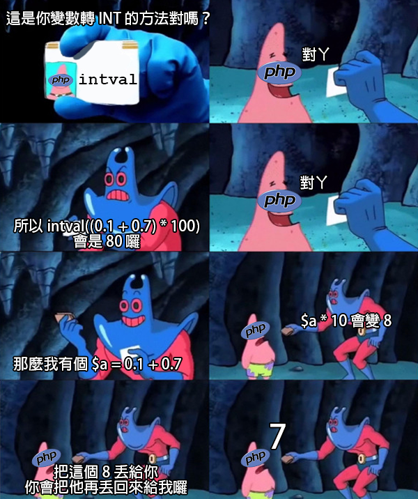


PHP 浮點數運算精度問題的深入分析。為什麼簡單的 0.1 + 0.7 經過 intval 處理後會出現意外的結果？


## 問題描述


**常見的 PHP 浮點數問題**

在 PHP 中，小數運算經常會遇到精度問題。例如：有 $a = 0.1 與 $b = 0.7 這兩個變數，相加乘以 10 後應該得到 8，但 intval 的結果卻是 7。


### intval 函數介紹

`intval` 是獲得變數整數值的方法，先參考 [php.net 官方文件](https://www.php.net/manual/zh/function.intval.php)。

## intval
```
<?php
function intval ($var, $base = null) {}
Get the integer value of a variable

intval

Get the integer value of a variable

<?php
function intval($var, $base = 10) { }
@param mixed $var — The scalar value being converted to an integer

@param int $base — [optional]

The base for the conversion

@return int
The integer value of var on success, or 0 on failure. Empty arrays and objects return 0, non-empty arrays and objects return 1.

The maximum value depends on the system. 32 bit systems have a maximum signed integer range of -2147483648 to 2147483647. So for example on such a system, intval('1000000000000') will return 2147483647. The maximum signed integer value for 64 bit systems is 9223372036854775807.

Strings will most likely return 0 although this depends on the leftmost characters of the string. The common rules of integer casting apply.

@link https://php.net/manual/en/function.intval.php

Get the integer value of a variable

intval( mixed $var [, int $base = 10 ]): integer
```

那我們就不囉唆，實際來測試一下 `intval` 如果真的把 `$a = 0.1` 與 `$b = 0.7` 相加後乘以 10 會得出什麼結果？

```php
$a = 0.1;
$b = 0.7;

$c = intval(($a + $b) * 10);
echo $c; // 7
```

這問題還蠻神奇的，那如果以此類推的話，乘以 20 會得到 14，乘以 100 會得到 70 囉？二話不說馬上來測試。

```php
$a = 0.1;
$b = 0.7;

$c = intval(($a + $b) * 20);
echo $c; // 15

$c = intval(($a + $b) * 100);
echo $c; // 80
```

這樣的結果還蠻訝異的，它居然會在乘以 20 的時候 `$a + $b` 就變成 7.5，然後乘以 100 的時候則變成 8，這個 `$a + $b` 的內容是什麼，我們有必要來檢查一下。

```php
$a = 0.1;
$b = 0.7;

$c = $a + $b;
echo $c; // 0.8

$c = $c * 10;
echo $c; // 8
```

到這邊都還蠻正常的，我們已經可以確信 `$c` 是 8，所以如果我直接把 `$c` 丟進去 `intval` 的話，整數 8 進去應該會獲得整數 8 囉？

```php
$a = 0.1;
$b = 0.7;

$c = $a + $b;
$c = $c * 10;

echo intval($c); // 7
```



反正無論如何，我只要確信我給 `intval` 的是 8，無論這個 8 是整數是浮點數是字串，只要它看起來像 8，只要你看得懂我給你的是 8 的話，你就會跟我說 8 對不對？

intval: 對。

```php
$a = 0.1;
$b = 0.7;

$c = $a + $b;
$c = $c * 10;

echo intval(strval($c)); // 8
```

我把 `$c` 給先轉成字串，再把它 `intval` 去處理，最後終於真真切切地得到 8 了，但這不像是一個好的做法，因此在此推廣 ...

# 珍惜生命，請學習型別宣告。

```php
(double) $a = 0.1;
(double) $b = 0.7;
(int) $c = ($a + $b) * 10;

echo $c; // 8
```
