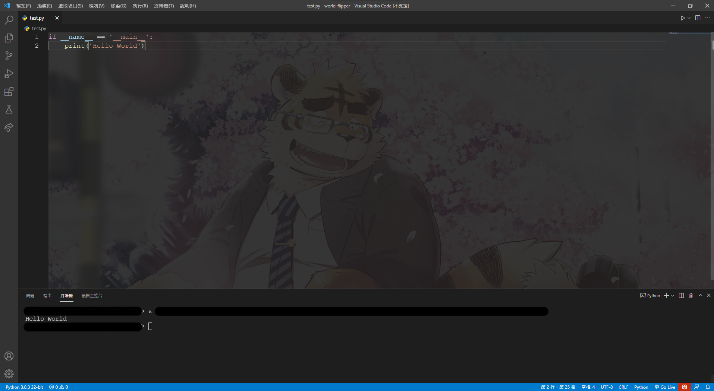

# 系列文章
- [安裝篇(目前這篇)](https://blog.init.engineer/posts/InstallPythonOpenCvAdb/)
- [測試篇](https://blog.init.engineer/posts/TestingPythonOpenCvAdb/)
- [操作篇](https://blog.init.engineer/posts/UsingPythonOpenCvAdb/)

最近在研究如何透過 `OpenCV` 來偵測畫面物件，並透過 `ADB` 來對 Android 模擬器做控制的動作，不過在此之前需要先做一個聲明，以下研究皆以學習、研究為目的。

### ADB(Android Debug Bridge)
對於 Android 開發人員而言 ADB(Android Debug Bridge) 這項工具一定不陌生，是 Android 的開發工具之一，透過 USB 或者 TCP 連接 Android 設備，並對其設備做出控制的動作，像試列出可用的裝置、安裝 APK 檔案、在 Android 系統上執行命令或從模擬器或裝置擷取檔案。

ADB 的詳細資訊可以參考 Android 的官方文件：
- [Android Debug Bridge (adb) - Android Developers](https://developer.android.com/studio/command-line/adb)

因此我們需要先安裝 Android SDK Platform Tools，

1. 下載 [Android SDK Platform Tools](https://developer.android.com/studio/releases/platform-tools)
2. 丟到任意地方，例如根目錄(C:\)當中
3. 將其設定為環境變數，`系統` -> `進階系統設定` -> `環境變數(N)` -> `Path` -> `編輯(I)...` -> `新增(N)` -> `貼上 platform-tools 的路徑` -> `確定`
4. 打開 CMD(命令提示字元) 測試看看能不能抓到 adb，直接輸入 `adb` 理論上應該可以看到下面這樣的輸出:

```shell
C:\Users\KanTai>adb
Android Debug Bridge version 1.0.41
Version 31.0.3-7562133
Installed as C:\platform-tools\adb.exe
...
```

接下來我們需要測試 ADB 是否能夠正常抓到 Android 模擬器，所以試試看 `adb devices`:

```shell
C:\Users\KanTai>adb devices
* daemon not running; starting now at tcp:5037
* daemon started successfully
List of devices attached
emulator-5554   device
```

可以看到在 `List of devices` 當中有抓到 `emulator-5554` 這個裝置，這代表我們 ADB 的部分已經設置完畢了，我們可以透過相關指令來對模擬器做出控制的動作，接下來我們需要準備 `Python` 以及 `OpenCV` 這兩樣東西，首先我們需要安裝 `Python`。

### Python
> Python 是一種廣泛使用的直譯式、進階和通用的程式語言。Python 支援多種程式設計範式，包括函數式、指令式、結構化、物件導向和反射式程式。它擁有動態型別系統和垃圾回收功能，能夠自動管理記憶體使用，並且其本身擁有一個巨大而廣泛的標準庫。 
>
> 取自於 [維基百科](https://zh.wikipedia.org/zh-tw/Python)

- [Python 官網](https://www.python.org)
- [Python 下載](https://www.python.org/downloads)

另外為了能夠撰寫 `Python` 的程式，我們需要有一個程式語言編輯器，在這邊我會推薦 `VSCode(Visual Studio Code)`，

> Visual Studio Code 是一款由微軟開發且跨平台的免費原始碼編輯器。該軟體支援語法突顯、代碼自動補全、代碼重構功能，並且內建了命令列工具和 Git 版本控制系統。使用者可以更改主題和鍵盤捷徑實現個性化設定，也可以通過內建的擴充程式商店安裝擴充以拓展軟體功能。
> 
> 取自於 [維基百科](https://zh.wikipedia.org/zh-tw/Visual_Studio_Code)

- [Visual Studio Code 官網](https://code.visualstudio.com/)
- [Visual Studio Code 下載](https://code.visualstudio.com/download)

接著我們需要嘗試看看能不能直接撰寫 `Python` 程式，我們可以透過 `VSCode` 新增一個 `index.py` 檔案，並且寫一個簡單的 Hello World 程式碼來直接運行:

```python
if __name__ == '__main__':
    print('Hello World')
```

理論上我們直接運行後，可以獲得 `Hello World` 的輸出，到這邊為止 `Python` 的準備就已經進行得差不多了，接下來只要準備最後一個項目，也就是 `OpenCV` 以後，就可以開始嘗試撰寫控制 Android 模擬器的程式。



### OpenCV
`OpenCV(Open Source Computer Vision Library)` 是一個跨平台的電腦視覺套件，也是我們這次練習主要的套件，我們需要透過 `OpenCV` 來將目標物件與螢幕截圖做比對，並計算出相似區塊、相似度等重要數值。

為了使用 `OpenCV` 我們需要先安裝它，而安裝它的方式有兩種，一種是直接透過 `pip` 來對其安裝，直接在 CMD(命令提示字元) 當中輸入並執行 `pip install opencv-python` 即可，另外一種方式是在專案當中新增一個 `requirements.txt` 文件，並將專案會使用的套件寫到這份文件當中，只要輸入並執行 `pip install -r requirements.txt` 這項指令，就可以將複數套件一次安裝齊全。

```shell
### 直接安裝 OpenCV Python
pip install opencv-python

### 透過 requirements.txt 來安裝相依套件
pip install -r requirements.txt
```

`requirements.txt` 檔案的內容:
```
opencv-python
```

到這邊為止，安裝篇的內容就進行得差不多了，接下來我們會進入測試的環節，測試 ADB 是否能夠抓取模擬器的螢幕截圖、測試 OpenCV 是否能夠抓取我們所想要的圖片，並且計算其位置、其準確率。

下一篇文章：[測試篇](https://blog.init.engineer/posts/TestingPythonOpenCvAdb/)
