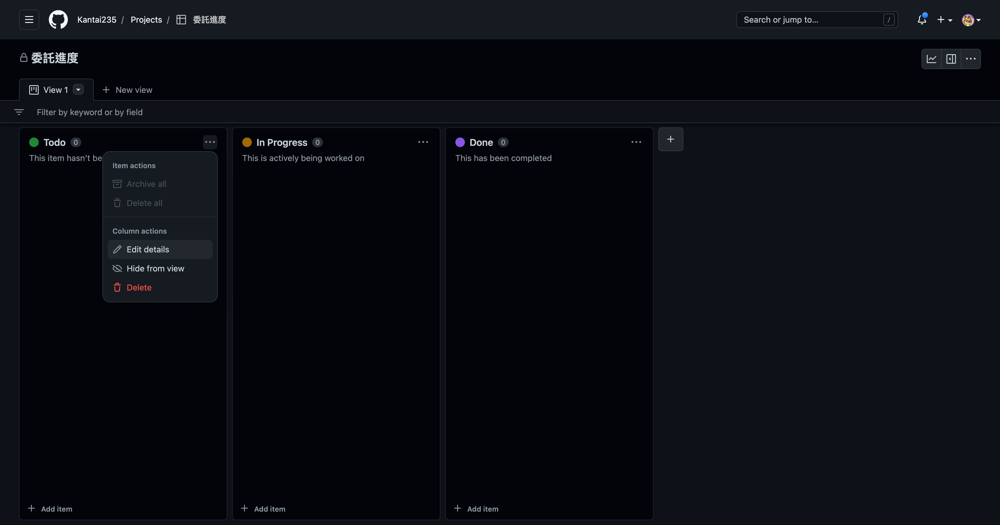

如果有在接觸軟體開發這件事的話，對於敏捷開發(Agile)這件事情應該不陌生，甚至於大型的專案上，為了確保每個功能細項都能如實執行，甚至還要能夠應付一直不斷變化的需求，所以我們會依賴一些工具來把項目給視覺化，以協助我們更容易對專案進行管理，這就是我們今天要介紹的 [GitHub Projects](https://docs.github.com/en/issues/planning-and-tracking-with-projects/learning-about-projects/about-projects) 功能，並且是以委託繪師為例子，緣由來自於[某位](https://twitter.com/a0960212623)繪師朋友的委託多到炸了，但要來整理委託又好麻煩，所以透過介紹這功能的同時，希望能藉此解決其他人的這類煩惱。

[GitHub Projects](https://docs.github.com/en/issues/planning-and-tracking-with-projects/learning-about-projects/about-projects) 是 [GitHub](https://github.com/) 平台提供的一個專案管理工具，它允許開發者和團隊在一個平台上組織和管理他們的工作流程。它提供了一個可自訂的看板，用於追蹤任務和專案的進度，協助團隊協作和提高工作效率。

不過本文章是以繪師接案來作為範例，因此以下展示了透過 [GitHub Projects](https://docs.github.com/en/issues/planning-and-tracking-with-projects/learning-about-projects/about-projects) 來作為工作流程的模樣：

如上圖所示，[GitHub Projects](https://docs.github.com/en/issues/planning-and-tracking-with-projects/learning-about-projects/about-projects) 提供了一個直覺的看板，用於管理和追蹤任務。繪師（團隊成員）可以輕鬆地拖放任務卡片，以反映任務的進度和狀態。此外，繪師（團隊成員）可以在任務卡片上添加詳細資訊和討論，以便日後可以更好地理解和追蹤任務的進度。

使用 [GitHub Projects](https://docs.github.com/en/issues/planning-and-tracking-with-projects/learning-about-projects/about-projects) 可以協助繪師更好地管理專案和工作流程。首先，您需要在 [GitHub](https://github.com/) 上註冊一個帳號，這是使用 [GitHub Projects](https://docs.github.com/en/issues/planning-and-tracking-with-projects/learning-about-projects/about-projects) 的前提。

> GitHub 註冊 ➡ https://github.com/signup

接下來，有兩種方式來建立看板，

方式一、透過建立 Repository，再建立 Project
1. 您可以點擊 GitHub 首頁右上角的加號按鈕，選擇 `New repository`，然後進入 `repository` 的設定頁面。
2. 在這個頁面中，您可以選擇是否將這個 `repository` 設置為公開或私人，以及命名您的 `repository`。
3. 在 `repository` 的設定中，您可以建立一個 `Projects` 看板。

方式二、直接建立 Project
1. 您可以點擊 GitHub 首頁右上角的加號按鈕，選擇 `New project`，然後進入 `project` 的設定頁面。

這裡我們採用方式二的做法來建立 Project 看板。

接下來我們為看板選擇 `Board` 的樣式，這個樣式會更適合作為管理專案和工作流程。

建立完成以後，看板將會有幾些預設的列，分別為 `Todo(等待執行)`、`In Progress(進行中)`、`Done(完成)` 三個列，當然我們也可以編輯這些列的內容。

只要點擊列表右上角的三點，就可以選擇 `Edit details(編輯詳細)` 來開啟編輯列的視窗。

一旦您建立了看板，您就可以開始設定列了。列通常用於將相關的任務分組。

例如，您可以建立一個 `提交委託`、`已確認委託`、`正在進行`、`委託完成`、`委託結束`。您可以根據您的需求來新增、刪除或重新排序列。

接下來，您可以透過頁面下方的輸入框來新增任務卡片，只要輸入內容即可新增，任務卡片包含有關一個具體任務的訊息，例如任務標題、描述、負責人、截止日期等等。

在這裡我們把卡片作為是委託人，每張卡片都屬於一位委託者、委託內容，您也可以使用拖放功能將委託卡片移動到不同的列中，以反映委託的狀態。

直接點擊卡片即可開啟卡片的詳細內容並且編輯。

除此之外，[GitHub Projects](https://docs.github.com/en/issues/planning-and-tracking-with-projects/learning-about-projects/about-projects) 還提供了其他一些有用的功能，例如在卡片中新增標籤，以便更好地組織和搜尋卡片；在卡片中設定檔案、連結或註解等等。

編輯完畢以後直接點擊 `Update comment` 即可儲存卡片的資訊。

當卡片進行到一個階段後，就可以直接拖曳卡片來當作卡片目前的狀態。

推薦可以為 Board 建立五個列，並作為五種用途，分別：

1. `提交委託`：新收到的委託。
2. `已確認委託`：已收到委託，排隊等待執行。
3. `正在進行`：正在進行當中的委託。
4. `委託完成`：已經完成委託，進行最後的確認、收款的步驟。
5. `委託結束`：已確認完畢並收款完成。

最後的成果會如同下圖：

